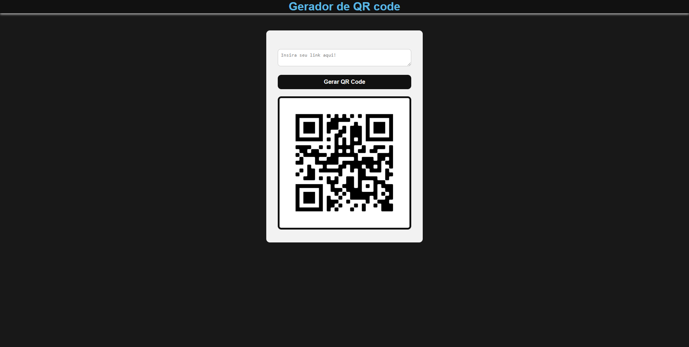

# gerador_qrcode
Website to generate qrcode through links.

## 🚀 Technologies
This project was developed with the following technologies:
- HTML
- CSS
- JavaScript
- API Google Chart
- Git & Github

## 📚 Libraries
- [JavaScript](https://developer.mozilla.org/pt-BR/docs/Web/JavaScript)

## 💻 Project

[Click here to access project](https://gerador-qrcode-six.vercel.app/)
> **Objective:** Create a QR Code Generator.
